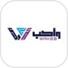
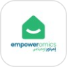
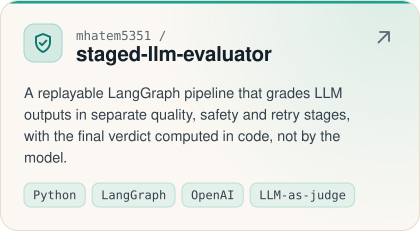
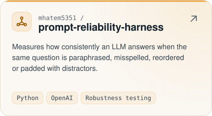
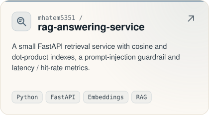
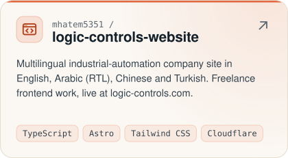
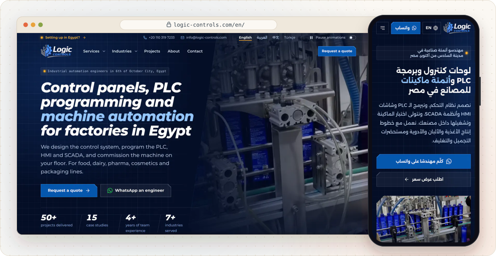
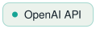

<picture><source media="(max-width: 600px) and (prefers-color-scheme: dark)" srcset="assets/banner-mobile-dark.svg"><source media="(max-width: 600px)" srcset="assets/banner-mobile-light.svg"><source media="(prefers-color-scheme: dark)" srcset="assets/banner-dark.svg"></picture>

<a href="https://www.linkedin.com/in/mohamed-hatem-6a5790173"><picture><source media="(prefers-color-scheme: dark)" srcset="assets/badges/linkedin-dark.svg"></picture></a><a href="mailto:mhatem5351@gmail.com"><picture><source media="(prefers-color-scheme: dark)" srcset="assets/badges/email-dark.svg"></picture></a><picture><source media="(prefers-color-scheme: dark)" srcset="assets/badges/aws-dark.svg"></picture><picture><source media="(prefers-color-scheme: dark)" srcset="assets/badges/msc-dark.svg"></picture>

**AI Team Lead at [Globant](https://www.globant.com).** I design, ship and run production LLM systems: multi-agent orchestration, retrieval (RAG), self-hosted model serving, and the evaluation and monitoring that keep them honest. I'm based in Cairo and work remotely with teams in the Gulf and the US, in English and Arabic.

I have **7 years of experience** in data and AI: SQL development, then data science, then building AI platforms in production, and I now lead an AI engineering team. I hold the **AWS Certified Machine Learning – Specialty** and an **M.Sc. in Data Science** from Cairo University.

## What I work on

<picture><source media="(prefers-color-scheme: dark)" srcset="assets/icons/agents-dark.svg"></picture>&nbsp; <b>Multi-agent LLM systems</b> LangGraph orchestration, from a 6-agent bilingual chatbot to a 14-agent assistant for a stock-media platform.

<picture><source media="(prefers-color-scheme: dark)" srcset="assets/icons/retrieval-dark.svg"></picture>&nbsp; <b>Retrieval</b> Hybrid vector + BM25 search with LLM reranking; semantic and visual search over millions of media assets.

<picture><source media="(prefers-color-scheme: dark)" srcset="assets/icons/serving-dark.svg"></picture>&nbsp; <b>LLM serving &amp; MLOps</b> vLLM on A100 GPUs, model versioning, health monitoring and automated recovery, Dockerized FastAPI and gRPC services, CI/CD.

<picture><source media="(prefers-color-scheme: dark)" srcset="assets/icons/quality-dark.svg"></picture>&nbsp; <b>Quality</b> LLM evaluation, tracing and observability, so we know a model is right before users find out it isn't.

<picture><source media="(prefers-color-scheme: dark)" srcset="assets/icons/bilingual-dark.svg"></picture>&nbsp; <b>Arabic + English</b> Most of what I have shipped is bilingual.

<picture><source media="(prefers-color-scheme: dark)" srcset="assets/icons/frontend-dark.svg"></picture>&nbsp; <b>Frontend</b> TypeScript, Astro and Tailwind CSS: an accessible site in four languages with Arabic RTL, built as freelance work (below).

## Experience

<picture><source media="(max-width: 600px) and (prefers-color-scheme: dark)" srcset="assets/timeline-mobile-dark.svg"><source media="(max-width: 600px)" srcset="assets/timeline-mobile-light.svg"><source media="(prefers-color-scheme: dark)" srcset="assets/timeline-dark.svg"></picture>

<b>AI Team Lead</b> · <a href="https://www.globant.com">Globant</a> Apr&nbsp;2026&nbsp;–&nbsp;present · remote 

<ul><li>Leading AI engineering on the STA project: multi-agent LLM orchestration, LLM serving and scalable RAG pipelines in production.</li></ul>

<b>Senior AI &amp; MLOps Engineer</b> · Wakeb Data Sep&nbsp;2024&nbsp;–&nbsp;Apr&nbsp;2026 · Giza, Egypt 

<ul><li>Architected a fully async, production multi-agent chatbot (LangGraph, Qwen served with vLLM on A100 GPUs): six specialised agents, modular subgraphs, Arabic and English.</li><li>Owned model serving end to end: vLLM configuration, GPU allocation, model versions, health checks and automated restarts across the production GPU servers.</li><li>Built hybrid retrieval (vector + BM25 with LLM reranking), node-level caching and web search over MCP, shipped as Dockerized FastAPI services behind Nginx.</li><li>Delivered the second generation of the AIP semantic search (more accurate, faster, with image search), the SALIC bilingual enterprise assistant with LLM evaluation and monitoring, and a research-paper agent with conversational memory.</li><li>Moved key internal APIs from REST to gRPC to cut latency between services.</li></ul>

<b>AI Engineer</b> · ArabsStock Apr&nbsp;2023&nbsp;–&nbsp;Dec&nbsp;2024 · remote 

<ul><li>Built the Arabsstock Assistant: 14 LangGraph agents covering semantic search, AI image generation, database operations and content moderation.</li><li>Engineered the platform's semantic search (OpenAI embeddings + Pinecone) and visual-similarity search across millions of stock photos, videos and vectors.</li><li>Extended the platform into audio: sound generation and search for a beta sound library, instrument classification, BPM detection and audio watermarking.</li></ul>

<b>Data Scientist</b> · Empoweromics Jan&nbsp;2022&nbsp;–&nbsp;Mar&nbsp;2023 · Cairo 

<picture><source media="(prefers-color-scheme: dark)" srcset="assets/badges/award-dark.svg"></picture>

<ul><li>Unified data from 3,008+ real-estate developers, each with its own schema, to scale the company's real-time e-map.</li><li>Built lead-lifecycle models for broker prioritisation, WhatsApp message classification (text and images) that routes messages to the right department, and a fuzzy &quot;smart search&quot; that finds clients despite misspellings.</li><li>Designed ETL from Cosmos DB to SQL Server with scheduled Azure triggers.</li></ul>

<b>Earlier roles</b> (2020 – 2022)
 

AI research assistant and lecturer for M.Sc. students in biomedical informatics, The British University in Dubai 2022 · part-time · remote 

<picture><source media="(prefers-color-scheme: dark)" srcset="assets/logos/mtc-dark.svg"></picture>AI instructor, Military Technical College, Cairo 2022 

Freelance data scientist, healthcare analytics for a US software company 2022 

SQL Developer, MDP 2020&nbsp;–&nbsp;2021 

## Featured work

<a href="https://github.com/mhatem5351/staged-llm-evaluator"><picture><source media="(prefers-color-scheme: dark)" srcset="assets/cards/staged-llm-evaluator-dark.svg"></picture></a>
<a href="https://github.com/mhatem5351/prompt-reliability-harness"><picture><source media="(prefers-color-scheme: dark)" srcset="assets/cards/prompt-reliability-harness-dark.svg"></picture></a>
<a href="https://github.com/mhatem5351/rag-answering-service"><picture><source media="(prefers-color-scheme: dark)" srcset="assets/cards/rag-answering-service-dark.svg"></picture></a>
<a href="https://github.com/mhatem5351/logic-controls-website"><picture><source media="(prefers-color-scheme: dark)" srcset="assets/cards/logic-controls-website-dark.svg"></picture></a>

- **[Arabic sentiment analysis](https://github.com/mhatem5351/Arabic-Sentiment-Analysis-With-Multiple-Models)**: BiGRU, CNN and classical models on about 455k Arabic texts with AraVec embeddings.
- **[Text summarization](https://github.com/mhatem5351/Text-Summarization-NLP)**: a Dash app comparing DistilBART, T5 and TextRank summaries (team project, AI diploma).

My other public repositories are coursework from my AI diploma (2021–22), kept as a record of where I started.

### Frontend: Logic Controls website

<a href="https://logic-controls.com"><picture><source media="(max-width: 600px) and (prefers-color-scheme: dark)" srcset="assets/showcase-mobile-dark.svg"><source media="(max-width: 600px)" srcset="assets/showcase-mobile-light.svg"><source media="(prefers-color-scheme: dark)" srcset="assets/showcase-dark.svg"></picture></a>

Freelance work: the site of an industrial-automation company in four languages (English, Arabic RTL, Chinese, Turkish), built with Astro, TypeScript and Tailwind CSS on Cloudflare Workers.

- **[Interactive HMI demo](https://logic-controls.com/en/#hmi-demo)** and motion design that respects reduced-motion settings.
- **Accessible and fast:** WCAG 2.2 AA (axe-clean), Lighthouse 98–100 on mobile and 100 on desktop.
- **Tested in CI:** about 950 unit tests and 900 end-to-end tests across Chrome, Android and iPhone Safari.
- **Contact form** with spam protection and email delivery via Workers.

<a href="https://logic-controls.com"><picture><source media="(prefers-color-scheme: dark)" srcset="assets/badges/live-dark.svg"></picture></a><a href="https://github.com/mhatem5351/logic-controls-website"><picture><source media="(prefers-color-scheme: dark)" srcset="assets/badges/source-dark.svg"></picture></a>

## Toolbox

<picture><source media="(prefers-color-scheme: dark)" srcset="assets/toolbox/llms-agents-dark.svg"></picture> <picture><source media="(prefers-color-scheme: dark)" srcset="assets/toolbox/langgraph-dark.svg"></picture><picture><source media="(prefers-color-scheme: dark)" srcset="assets/toolbox/openai-api-dark.svg"></picture><picture><source media="(prefers-color-scheme: dark)" srcset="assets/toolbox/azure-openai-dark.svg"></picture><picture><source media="(prefers-color-scheme: dark)" srcset="assets/toolbox/qwen-dark.svg"></picture><picture><source media="(prefers-color-scheme: dark)" srcset="assets/toolbox/vllm-dark.svg"></picture><picture><source media="(prefers-color-scheme: dark)" srcset="assets/toolbox/mcp-dark.svg"></picture><picture><source media="(prefers-color-scheme: dark)" srcset="assets/toolbox/langfuse-dark.svg"></picture>

<picture><source media="(prefers-color-scheme: dark)" srcset="assets/toolbox/retrieval-dark.svg"></picture> <picture><source media="(prefers-color-scheme: dark)" srcset="assets/toolbox/pinecone-dark.svg"></picture><picture><source media="(prefers-color-scheme: dark)" srcset="assets/toolbox/qdrant-dark.svg"></picture><picture><source media="(prefers-color-scheme: dark)" srcset="assets/toolbox/pgvector-dark.svg"></picture><picture><source media="(prefers-color-scheme: dark)" srcset="assets/toolbox/hybrid-bm25-plus-dense-search-dark.svg"></picture><picture><source media="(prefers-color-scheme: dark)" srcset="assets/toolbox/llm-reranking-dark.svg"></picture>

<picture><source media="(prefers-color-scheme: dark)" srcset="assets/toolbox/backend-infra-dark.svg"></picture> <picture><source media="(prefers-color-scheme: dark)" srcset="assets/toolbox/python-dark.svg"></picture><picture><source media="(prefers-color-scheme: dark)" srcset="assets/toolbox/fastapi-dark.svg"></picture><picture><source media="(prefers-color-scheme: dark)" srcset="assets/toolbox/grpc-dark.svg"></picture><picture><source media="(prefers-color-scheme: dark)" srcset="assets/toolbox/postgresql-dark.svg"></picture><picture><source media="(prefers-color-scheme: dark)" srcset="assets/toolbox/docker-dark.svg"></picture><picture><source media="(prefers-color-scheme: dark)" srcset="assets/toolbox/kubernetes-aws-eks-dark.svg"></picture><picture><source media="(prefers-color-scheme: dark)" srcset="assets/toolbox/nginx-dark.svg"></picture><picture><source media="(prefers-color-scheme: dark)" srcset="assets/toolbox/ci-cd-dark.svg"></picture>

<picture><source media="(prefers-color-scheme: dark)" srcset="assets/toolbox/frontend-dark.svg"></picture> <picture><source media="(prefers-color-scheme: dark)" srcset="assets/toolbox/typescript-dark.svg"></picture><picture><source media="(prefers-color-scheme: dark)" srcset="assets/toolbox/astro-dark.svg"></picture><picture><source media="(prefers-color-scheme: dark)" srcset="assets/toolbox/tailwind-css-dark.svg"></picture><picture><source media="(prefers-color-scheme: dark)" srcset="assets/toolbox/accessibility-dark.svg"></picture><picture><source media="(prefers-color-scheme: dark)" srcset="assets/toolbox/i18n-rtl-dark.svg"></picture><picture><source media="(prefers-color-scheme: dark)" srcset="assets/toolbox/playwright-dark.svg"></picture>

<picture><source media="(prefers-color-scheme: dark)" srcset="assets/toolbox/ml-data-dark.svg"></picture> <picture><source media="(prefers-color-scheme: dark)" srcset="assets/toolbox/pytorch-dark.svg"></picture><picture><source media="(prefers-color-scheme: dark)" srcset="assets/toolbox/tensorflow-dark.svg"></picture><picture><source media="(prefers-color-scheme: dark)" srcset="assets/toolbox/scikit-learn-dark.svg"></picture><picture><source media="(prefers-color-scheme: dark)" srcset="assets/toolbox/spark-dark.svg"></picture><picture><source media="(prefers-color-scheme: dark)" srcset="assets/toolbox/sql-server-dark.svg"></picture><picture><source media="(prefers-color-scheme: dark)" srcset="assets/toolbox/azure-dark.svg"></picture><picture><source media="(prefers-color-scheme: dark)" srcset="assets/toolbox/aws-dark.svg"></picture>

## Education & certifications

&nbsp; <b>M.Sc. Data Science</b> Cairo University (Faculty of Graduate Studies for Statistical Research) · 2023&nbsp;–&nbsp;2026

&nbsp; <b>Diploma in Artificial Intelligence</b> Information Technology Institute (ITI), 9-month program with EPITA Paris · 2021&nbsp;–&nbsp;2022

&nbsp; <b>B.Eng. Structural Engineering</b> Tanta University · 2015&nbsp;–&nbsp;2020

&nbsp; <b>AWS Certified Machine Learning – Specialty</b> Amazon Web Services · 2022

<picture><source media="(prefers-color-scheme: dark)" srcset="assets/divider-dark.svg"></picture>

<b>Get in touch</b>  <a href="https://www.linkedin.com/in/mohamed-hatem-6a5790173"><picture><source media="(prefers-color-scheme: dark)" srcset="assets/badges/linkedin-dark.svg"></picture></a><a href="mailto:mhatem5351@gmail.com"><picture><source media="(prefers-color-scheme: dark)" srcset="assets/badges/email-dark.svg"></picture></a>

